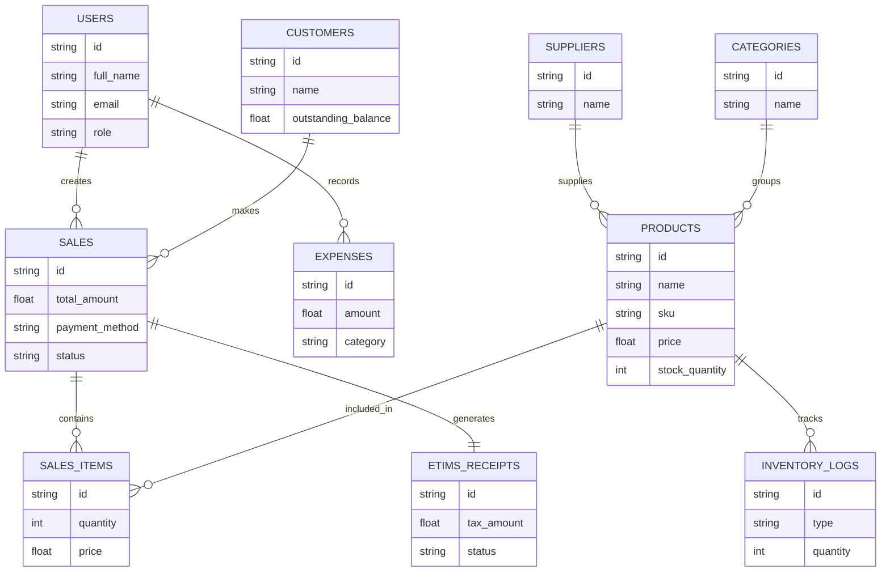

---

# 🗄️ ElahoPOS ERD (Entity Relationship Design)

## Overview

This ERD represents the **core data model of ElahoPOS**, designed for:

* Offline-first POS operations
* Inventory tracking
* Sales processing
* Expense management
* Customer credit systems
* Supplier management
* eTIMS tax compliance
* Sync-safe architecture (UUID + timestamps)

---

# 🧩 Core Entities & Relationships

## 1. USERS

Represents system users (cashiers, admins, managers).

**Fields**

* id (UUID)
* full_name
* email
* password_hash
* role (admin, cashier, manager)
* business_id (FK)
* created_at

**Relationships**

* USERS → SALES (1:M)
* USERS → EXPENSES (1:M)

---

## 2. PRODUCTS

Stores all items sold in the system.

**Fields**

* id (UUID)
* name
* sku
* barcode
* price
* cost_price
* stock_quantity
* category_id (FK)
* supplier_id (FK)
* created_at

**Relationships**

* PRODUCTS → SALES_ITEMS (1:M)
* PRODUCTS → INVENTORY_LOGS (1:M)

---

## 3. CATEGORIES

Product grouping.

**Fields**

* id (UUID)
* name
* description

**Relationships**

* CATEGORIES → PRODUCTS (1:M)

---

## 4. SUPPLIERS

Product suppliers.

**Fields**

* id (UUID)
* name
* phone
* email
* location

**Relationships**

* SUPPLIERS → PRODUCTS (1:M)

---

## 5. CUSTOMERS

Customer profiles (including credit customers).

**Fields**

* id (UUID)
* name
* phone
* email
* credit_limit
* outstanding_balance

**Relationships**

* CUSTOMERS → SALES (1:M)

---

## 6. SALES

Main transaction table.

**Fields**

* id (UUID)
* user_id (FK)
* customer_id (FK, nullable)
* total_amount
* payment_method (cash, mpesa, credit)
* status (completed, pending)
* created_at

**Relationships**

* SALES → SALES_ITEMS (1:M)
* SALES → USERS (M:1)
* SALES → CUSTOMERS (M:1)

---

## 7. SALES_ITEMS

Line items inside a sale.

**Fields**

* id (UUID)
* sale_id (FK)
* product_id (FK)
* quantity
* price
* subtotal

**Relationships**

* SALES_ITEMS → SALES (M:1)
* SALES_ITEMS → PRODUCTS (M:1)

---

## 8. INVENTORY_LOGS

Tracks all stock movements.

**Fields**

* id (UUID)
* product_id (FK)
* type (IN / OUT / ADJUSTMENT)
* quantity
* reason
* created_at

**Relationships**

* INVENTORY_LOGS → PRODUCTS (M:1)

---

## 9. EXPENSES

Business operational costs.

**Fields**

* id (UUID)
* user_id (FK)
* category
* amount
* description
* created_at

**Relationships**

* EXPENSES → USERS (M:1)

---

## 10. ETIMS_RECEIPTS

Tax compliance integration layer.

**Fields**

* id (UUID)
* sale_id (FK)
* tax_amount
* receipt_number
* status (pending, submitted, verified)
* created_at

**Relationships**

* ETIMS_RECEIPTS → SALES (1:1)

---

## 11. SYNC_LOGS (Offline-first core table)

Tracks sync operations from devices.

**Fields**

* id (UUID)
* device_id
* entity_type
* operation (CREATE/UPDATE/DELETE)
* payload (JSON)
* status (pending/synced/failed)
* created_at

---

# 🔗 Full Relationship Summary

* USERS → SALES (1:M)
* USERS → EXPENSES (1:M)
* CUSTOMERS → SALES (1:M)
* SALES → SALES_ITEMS (1:M)
* PRODUCTS → SALES_ITEMS (1:M)
* PRODUCTS → INVENTORY_LOGS (1:M)
* SUPPLIERS → PRODUCTS (1:M)
* CATEGORIES → PRODUCTS (1:M)
* SALES → ETIMS_RECEIPTS (1:1)

---

# 🧠 ERD Diagram
---

---

# 📌 Notes (Important Design Decisions)

### 1. UUID-based design

Ensures:

* offline sync compatibility
* no collision between devices
* distributed system readiness

---

### 2. Audit-friendly logs

* InventoryLogs and SyncLogs ensure traceability
* supports fraud prevention + compliance

---

### 3. eTIMS decoupling

* ETIMS is isolated as its own entity
* prevents core POS logic from breaking due to tax API changes

---

### 4. Offline-first support

* SyncLogs act as the bridge between IndexedDB and backend
* supports eventual consistency model

---

